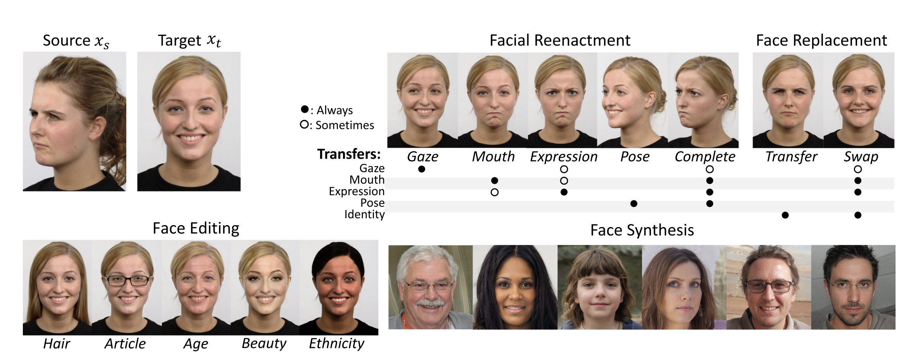

# deepfake-detection
a resource manual for deepfake detection by **@imreallyjohn**

# What are Deepfakes?
A deepfake is content ( could be an image, video or even audio! ), generated by an artificial intelligence, that is authentic in the eyes of a human being. The word deepfake is a combination of the words “deep learning” and “fake,” and primarily relates to content generated by an artificial neural network, a branch of machine learning. The most common form of deepfakes involve the generation and manipulation of human imagery. [[1]](https://dl.acm.org/doi/abs/10.1145/3425780)

Deepfakes are usually generated using some visual synthesis algorithms. For example, here is one sample which attempts to synthesize important features of humans like expressions, gaze, mouth, etc; along with some reenactment and replacement (also known as Face Swap) 

# Datasets

Some of the state-of-the-art datasets which synthesize deepfakes very accurately are,

- [Celeb-DF](https://openaccess.thecvf.com/content_CVPR_2020/papers/Li_Celeb-DF_A_Large-Scale_Challenging_Dataset_for_DeepFake_Forensics_CVPR_2020_paper.pdf) a large-scale deepfake video dataset containing 5639 HQ Deepfake videos [CVPR 2020] [Dataset Download Link](https://forms.gle/2jYBby6y1FBU3u6q9)
- [FaceForensics++](http://niessnerlab.org/projects/roessler2018faceforensics.html) another large-scale deepfake video dataset containing 3000+ deepfake videos [Dataset Download Link](https://docs.google.com/forms/u/1/d/e/1FAIpQLSdRRR3L5zAv6tQ_CKxmK4W96tAab_pfBu2EKAgQbeDVhmXagg/viewform)

# Current Techniques
For more insights please refer to [Literature Survey](literature%20survey)
